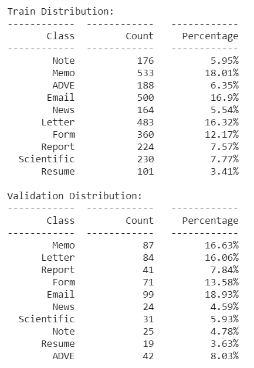
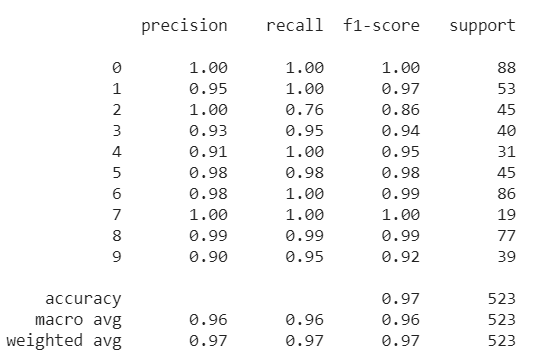
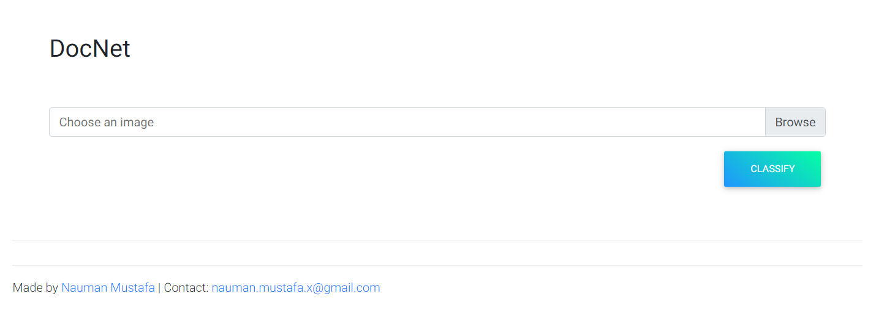

# docnet - Document Classification

An end-to-end implementation of deep learn pipeline. 
From data preparation to training to production.

## Get started

### Training the model

In [training](training) directory, there is a 
[notebook](training/docnet_classifier_training.ipynb)
which has been tested to work on colab. You will
require google cloud account to cache processed
data because doing OCR takes a lot of time so it is
stored on google cloud storage.

Follow the notebook, it will prepare `Tobacco-3482`
dataset for training. Notebook will split data into
training and validation dataset as follow:

 

After training, you will see
the results like this:



After training, model is exported to google cloud 
storage. After downloading model, extract that in 
[classifier model](classifier/model) directory.

### Running an end-to-end demo

To run the application, you will need docker and
docker-compose. Clone this repo in some directory 
and cd into that directory. Run the following 
command:

```bash
docker-compose up
```

This command will build the required containers and
configure and run those containers locally.
After initialization go to 
[this address](http://localhost:8080/) and you will
see a screen like this:



 - Click browse and select some document image
 - Click classify and you will see it added to processing list
 - After processing it will show the class and confidence

Only following document classes are supported:

```text
Email
Form
ADVE
Report
Scientific
News
Letter
Resume
Memo
Note
```


